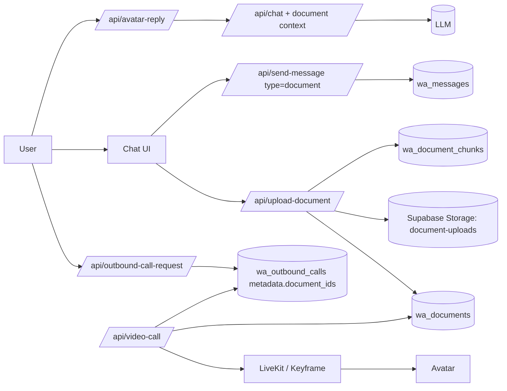

# PDF Sharing + Avatar Grounding (Chat + Video-Call)

## Goal
Enable users to share a PDF in chat, have the avatar read it, and reference it directly in both chat and live calls, including the handoff flow:

- User shares PDF in chat.
- User writes: "Call me to discuss this PDF."
- Outbound call starts with document-aware context.

## Architecture

## Data Model

- `wa_documents`: document metadata + extracted full text.
- `wa_document_chunks`: chunked text for relevance retrieval.
- `wa_messages.document_id`: links chat message to uploaded document.

## Retrieval Strategy (Phase 1)

- Lightweight lexical scoring over chunks (query-token overlap).
- Top chunks appended as `[SHARED DOCUMENT CONTEXT]`.
- Avatar instructed to reference doc name/section naturally.

## Call Handoff

- `requestOutboundCall()` now sends `documentIds`.
- `/api/outbound-call-request` stores `metadata.document_ids`.
- `/api/video-call` reads those IDs and injects extracted document snippets into call memory context.

## Implemented in this phase

- PDF upload API + extraction + chunk persistence.
- Chat UI "Share PDF" action.
- `document` message type path in client/server.
- Chat-time document grounding.
- Outbound call document handoff scaffolding.
- Video-call memory injection from shared PDFs.

## Next Steps (Phase 2)

- Embedding-based retrieval for higher precision.
- PDF page anchors and quote spans in responses.
- Explicit "sources" renderer in chat/call UI.
- Role-aware RLS for invited users reading only allowed docs.
- Background re-processing for OCR scans and large PDFs.
